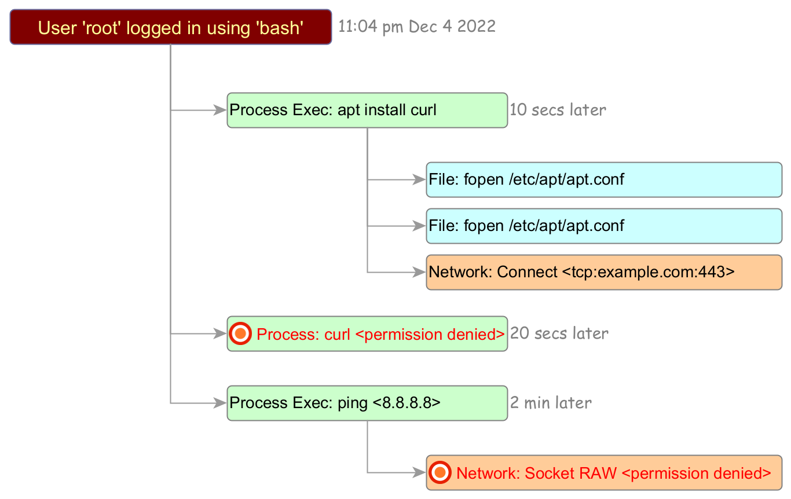

# Wordpress telemetry information from KubeArmor

## How is this data taken?

1. Install k3s based k8s environment
2. Install kubearmor and discovery-engine
3. Install wordpress-mysql application
4. Start `karmor log --json --logFilter=all --namespace wordpress-mysql | tee wordpress-mysql.json` to get the telemetry data.
5. Enable port-forwarding for the wordpress application so that you can access it from the host (`kubectl port-forward -n wordpress-mysql service/wordpress --address 0.0.0.0 --address :: 8082:80`)
6. Go to [https://localhost:8082/](https://localhost:8082/) and start accessing pages etc. You will see telemetry data flowing in step 4.

Details of first three steps can be found [here](https://help.accuknox.com/open-source/quick_start_guide/).

## What does this contain?

This contains telemetry data for all the system level events in wordpress and mysql app,  namely,
1. Process invocation events
2. File Access events
3. Network events (socket, bind, connect, accept)

KubeArmor does not intercept network I/O, disk I/O, or file I/O related events.

## What kind of use-cases can be fulfilled using this?

1. Show all the process forks/spawns in the workload. (Supported)
2. Show all file access events with aggregated view. Aggregation means that if there are more that three different file accesses within the same directory then just show the directory name. (Supported)
3. Show all ingresss, egress communications. (Supported)

## Advanced use-cases not supported today?

1. Show activity of a logged in user from bash i.e., what all attempts were made after the login? This involves keeping a trace of user login (invocation of bash), subsequent commands executed as part of that bash, showing what was allowed, what was denied.

